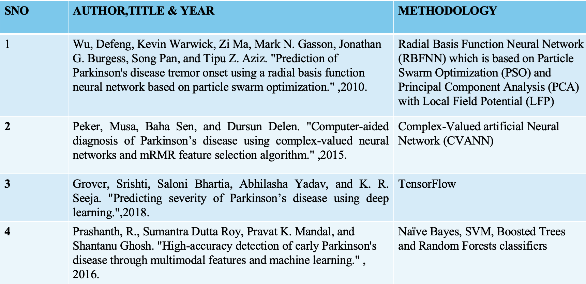
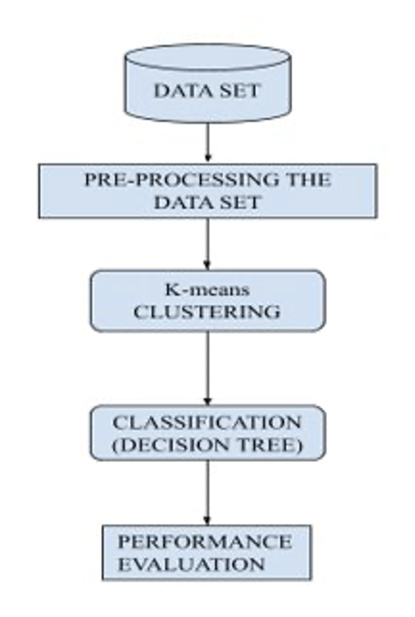
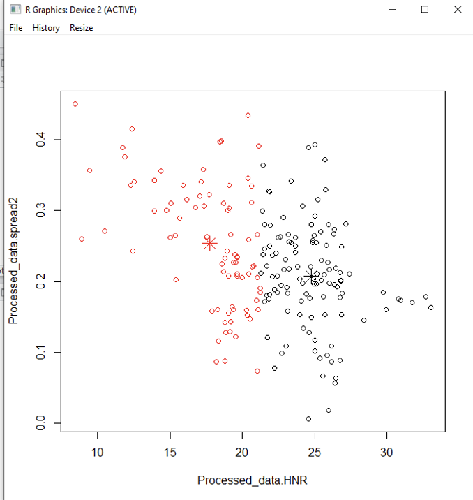
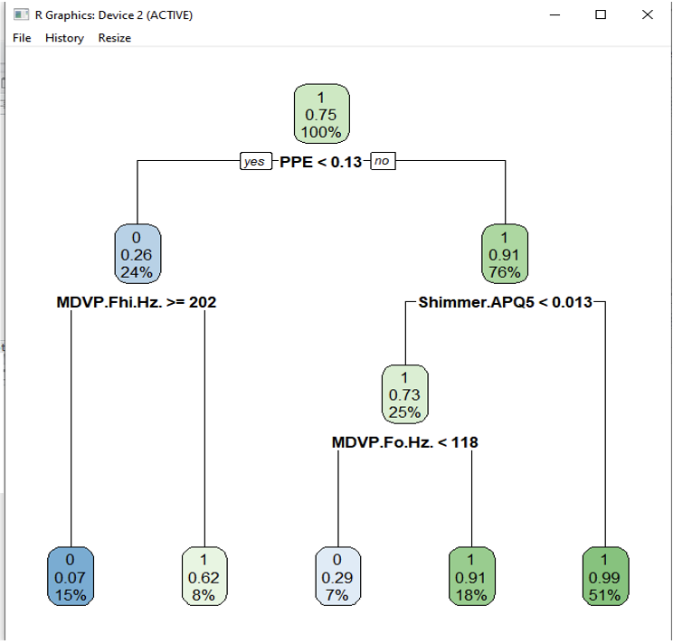

# Parkinsons-Disease-Prediction
Predictive Modeling using R Programming

<h2>Introduction:</h2>
<ul><li>Parkinson's Disease (PD) is a progressive neurological disorder that causes tremor. As there is no particular system for the diagnosis of PD, it is required to design an automatic diagnostic system that assists the neurologists.</li>
<li>It is distinguished by tremor, muscular rigidity, and weary movement, mostly affecting elderly people. </li>
<li>It occurs when nerve cells, or neurons, become damaged or die in an area of the brain which controls movement.</li>
<li>Because of this damage, the production of a neurotransmitter in our body called dopamine gets reduced.</li></ul>

<h2>Literature Survey:</h2>

<h2>Proposed Work:</h2>
<ul><li>In k-CCDT, the dataset is taken in a csv format and is preprocessed by removing all the unwanted or empty values. </li>
<li>Then, clustering is performed that divides the data points into two subsets which help in performing the classification algorithm to easily identify to which class or category the data point will rely. </li>
<li>Clustering is the technique which is used most profusely to get an intuition about the data structure. K-means clustering is a method of vector quantization.</li>
<li>The centroids for the clusters are computed by taking the average of the all data points that belong to each cluster.</li>
<li>Classification Trees are used where the target variable is categorical. From this tree a confusion matrix is derived which is a table that is used for performance evaluation of a classification model.</li></ul>

<h2>Architecture:</h2>

<ul><li>The above architecture diagram is based on the k-CCDT system, where the data are collected in a CSV format.</li>
<li>The retrieved data will undergo a process in which all the unwanted and a empty values are removed,this phase is called preprocessing of data set.</li>
<li>Division of data points into two subsets is performed by k-means clustering where the identification process is done by classification algorithm.</li>
<li>Then the performance evaluation of the classification model is carried out.</li></ul>

<h2>Dataset:</h2>
<ul><li>Voice deterioration has been detected as the main symptoms of the PD. About 90% of people having PD are spotted with some kind of voice deterioration. Hence, voice measurement is used here in order to achieve great progress in the advancement of PD. </li>
<li>The data set that mainly consists of 23 attributes namely MDVP: Fo (Hz), MDVP: Fhi (Hz), MDVP: Flo(Hz), MDVP: Jitter (%), MDVP: Jitter(Abs), MDVP: RAP, MDVP:PPQ, Jitter: DDP, MDVP: Shimmer, MDVP: Shimmer(dB), Shimmer: APQ3, Shimmer: APQ5, MDVP: APQ, Shimmer: DDA, NHR, HNR, status, RPDE, DFA, spread1, spread2, D2, PPE.</li></ul>

<h2>Clustering:</h2>

<ul><li>Clustering is the technique which is used most profusely to get an intuition about the data structure. K-means clustering is a method of vector quantization.</li>
<li>It is also called an iterative algorithm which helps to partition the data into K pre-defined distinct non-overlapping subgroups (clusters), where every data directs to only one group based on similarities.</li></ul>

<h2>Classification:</h2>

<ul><li>Classification is performed to make it easy for the system to identify to which cluster the new data point will rely on. </li>
<li>Classification is dividing or categorizing which means this algorithm uses divide and conquer methodology to achieve the goal of the system. </li>
<li>Decision tree is a model used to represent the relationships between the attributes.</li>
<li>Using binary recursive partitioning, this tree is constructed. This is an iterative method of dividing the data into partitions and then further dividing it into each of the branches.
</li></ul>

<h2>Conclusion:</h2>
<ul><li>To recapitulate, the aim of the proposed system is to accurately identify how much test set PD data is correctly identified using the acoustic vocal input that is converted into a csv file. </li>
<li>To achieve this, two algorithms are implemented. First, clustering is performed to split the data into 2 clusters and then classification is performed after dividing the dataset into test and train sets. </li>
<li>Decision tree is plotted with which a confusion matrix is generated. The prediction performance of the proposed system is also tested with different evaluation criteria which includes accuracy, sensitivity, specificity, precision, F measure.</li></ul>

<h2>Future Enhancement:</h2>
<ul><li>By connecting a hardware device to the input end, this project can be advanced. </li>
<li>So that the input can be generated in real-time and processed so that the output is generated in relation to the input which is subsequently applied to the train set, making the device more efficient. </li>
<li>The better the data from the training, the better the model performs. The quality and amount of your training information really has as much to do with the success of your data project.</li></ul>

